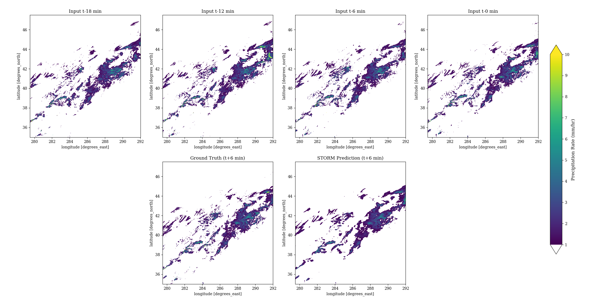

# STORM: A Spatio-Temporal Model for Precipitation Nowcasting

This repository contains the code and resources for the STORM project, a deep learning model for precipitation nowcasting based on weather radar data. The model was developed as part of the Deep Learning Workshop at Tel Aviv University.

## Overview

The project aims to predict future radar-based precipitation frames using a sequence of past frames. The core of the project is the **STORM** model, a U-Net style autoencoder with a ConvLSTM bottleneck, designed to capture both spatial and temporal dynamics.



## Repository Structure

```
STORM-Nowcasting/
├── data_creation/      # Scripts to download and process the raw radar data
├── models/             # Contains the STORM model architecture definition
├── training/           # Scripts and configs for training the model and running sweeps
├── evaluation/         # Scripts for quantitative and qualitative evaluation
├── notebooks/          # Jupyter notebook for demonstration and analysis
└── saved_weights/       # Directory to store trained model weights
```
